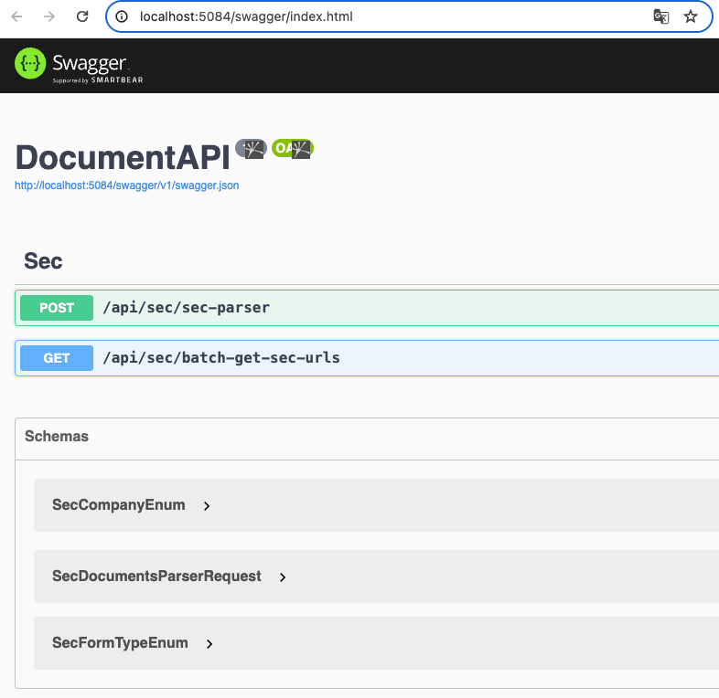

# DocuChat
DocuChat is a full-stack web application developed using C#, .NET 8.0, and Blazor. The goal is to provide a cost-effective chat interface for users to interact with documents. It will prioritize accuracy, minimize errors, and aim to deliver a high-quality user experience.
## Features
- Parses SEC documents and extracts relevant data. (build in progress)
- Use LLM and RAG to develop a chatbot capable of interpreting and responding to queries based on information extracted from SEC documents. (coming soon)
## How to Run the Project
1. Ensure you have .NET 8 SDK installed on your machine. You can download it from the official .NET website.  
2. Clone the repository which will open the solution:  <pre>git clone https://github.com/your-repo/DocumentAPI.git </pre>
3. Open the user secret file and paste this in the file.
    I am using Mac, the user secret file in Rider IDE is by right-click the project -> tools -> .NET user secrets. 
    <pre>{"SecUserAgent": "Personal-Project/1.0 (+{{your email}@gmail.com)"}</pre>

4. Run the project.
   
   
   
   ### ParseDocuments
   ``` bash
   curl --location 'http://localhost:5084/api/sec/sec-parser' \
   --header 'accept: */*' \
   --header 'Content-Type: application/json' \
   --header 'X-CALLING-APP: CompanyA' \
   --data '{
   "secDocumentUrls": [
   "https://www.sec.gov/Archives/edgar/data/320193/000032019319000119/a10-k20199282019.htm",
   "https://www.sec.gov/Archives/edgar/data/320193/000032019323000106/aapl-20230930.htm",
   "https://www.sec.gov/Archives/edgar/data/320193/000032019322000108/aapl-20220924.htm",
   "https://www.sec.gov/Archives/edgar/data/320193/000032019321000105/aapl-20210925.htm",
   "https://www.sec.gov/Archives/edgar/data/320193/000032019320000096/aapl-20200926.htm",
   "https://www.sec.gov/Archives/edgar/data/789019/000156459020034944/msft-10k_20200630.htm",
   "https://www.sec.gov/Archives/edgar/data/1318605/000162828024002390/tsla-20231231.htm"
   ],
   "secDocumentTypeEnum": 1
   }'
   ```
   

   
   ### BatchGetDocumentUrls
   ``` bash
   curl --location 'http://localhost:5084/api/sec/batch-get-sec-urls?formType=1&startDate=2019-04-30&endDate=2024-04-30' \
   --header 'accept: */*'
   }'
   ```
   
   


## How It was built
### Analysis
1. Data
   - Schema: https://www.sec.gov/files/form10-k.pdf / https://sec-api.io/docs/sec-filings-item-extraction-api
   - Scraping rule: https://www.sec.gov/os/webmaster-faq#developers
   - Search: https://www.sec.gov/edgar/search/#/q=Microsoft&category=custom&forms=10-K
2. Requirement
   - Start from 10K and 10Q forms.
   - Extract the specific sections from the forms.
   - Do a load testing, say 200 documents.
### Code
1. Algorithms
   - Levenshtein Distance for Measuring Text Similarity
2. Libraries
   - HtmlAgilityPack library to parse the HTML documents
   - Carter library for routing and handling requests, so I don't need to write my own filters from scratch and can have more time to focus on the business.
   - Polly library that provides resilience strategies in fluent-to-express policies such as Retry, WaitAndRetry, and CircuitBreaker, etc.
   - ...

